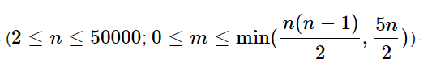

# G. Возможные друзья (20 баллов)
    > ограничение по времени на тест: 3 секунды
    > ограничение по памяти на тест: 512 мегабайт
    > ввод: стандартный ввод
    > вывод: стандартный вывод

Во многих социальных сетях у пользователей есть возможность указать других пользователей как своих друзей. Помимо этого, часто существует система рекомендации друзей, которая показывает пользователям людей, с которыми они знакомы косвенно (через кого-то из своих друзей), и предлагает добавить этих людей в список друзей. Вам предстоит разработать систему рекомендации друзей.

В интересующей нас социальной сети n
 пользователей, каждому из которых присвоен уникальный id от 1
 до n
. У каждого пользователя этой сети не более 5
 друзей. Очевидно, ни один пользователь не является другом самому себе, и если пользователь x
 в списке друзей у пользователя y
, то и пользователь y
 входит в список друзей пользователя x
.

Опишем, как должен формироваться список возможных друзей для каждого пользователя. Для пользователя x
 в список должны входить такие пользователи y
, что:

y
 не является другом x
 и не совпадает с x
;
у пользователя y
 и у пользователя x
 есть хотя бы один общий друг;
не существует такого пользователя y′
, который удовлетворяет первым двум ограничениям, и у которого строго больше общих друзей с x
, чем у (y)
 с (x)
.
Иными словами, в список возможных друзей пользователя x
 входят все такие пользователи, не являющиеся его друзьями, для которых количество общих друзей с x
 максимально. Обратите внимание, что список возможных друзей может быть пустым.

Вы должны написать программу, которая по заданной структуре социальной сети формирует списки возможных друзей для всех пользователей сети.

Неполные решения этой задачи (например, недостаточно эффективные) могут быть оценены частичным баллом.

## Входные данные
В первой строке заданы два целых числа n
 и m  
   
 — количество пользователей и количество пар друзей, соответственно.

Далее следуют m
 строк, в каждой из которых заданы два целых числа xi
 и yi
 (1≤xi,yi≤n
; xi≠yi
) — очередная пара друзей в социальной сети. Каждая пара друзей задается не более одного раза; у каждого пользователя не более 5
 друзей.

## Выходные данные
Для каждого пользователя от 1
 до n
 выведите в отдельной строке список его возможных друзей в следующем формате:

если список возможных друзей пуст, выведите одно целое число 0
;
иначе выведите id возможных друзей пользователя в возрастающем порядке.

### Примеры
### входные данные
8 6  
4 3  
3 1  
1 2  
2 4  
2 5  
6 8  

### выходные данные
4  
3  
2  
1  
1 4  
0  
0  
0  

### входные данные
8 10  
1 2  
1 3  
1 4  
4 3  
3 2  
2 4  
1 8  
5 6  
7 6  
5 7  

### выходные данные
0  
8  
8  
8  
0  
0  
0  
2 3 4  